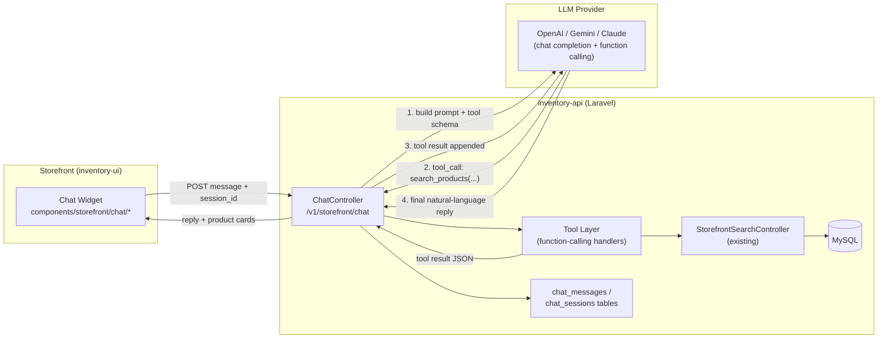
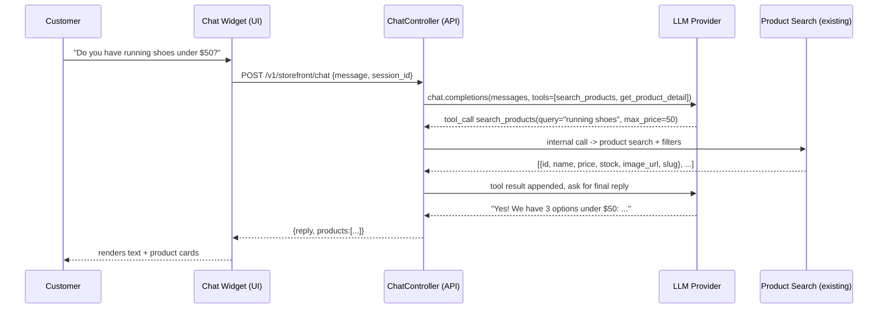
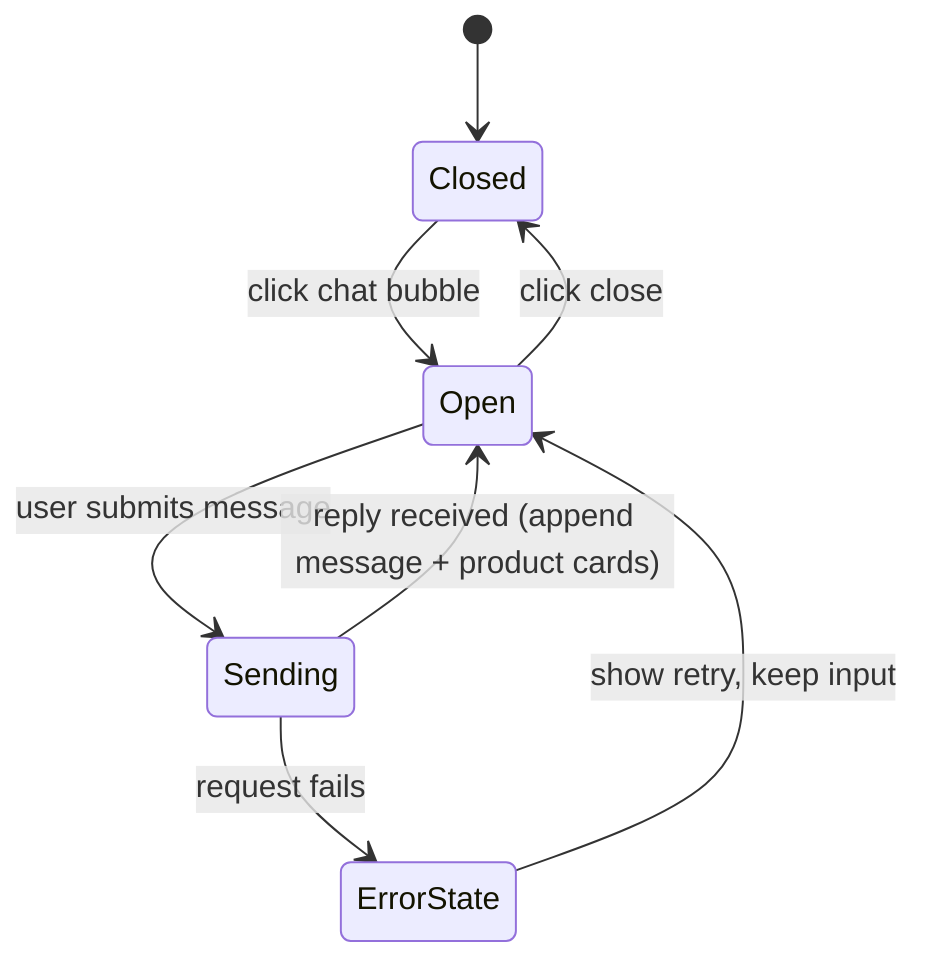

# AI Product Search & Chat Assistant — Implementation Plan

Goal: give storefront customers a chat widget where they can ask things like
*"do you have a red hoodie under $30?"* and get natural-language answers backed
by real, live product data (stock, price, brand, category) from the existing
inventory system — not hallucinated answers.

---

## 1. High-Level Architecture



**Key idea (RAG via function-calling, not fine-tuning):** the LLM never invents
product data. It calls a `search_products` "tool" that hits your real
`StorefrontSearchController` (or a dedicated AI-facing endpoint), gets JSON
back, and only then writes a natural-language reply referencing that JSON.
This avoids hallucinated prices/stock and needs no vector DB for a v1.

---

## 2. Sequence of a Single Chat Turn



---

## 3. Backend (inventory-api) Steps

### 3.1 Choose & configure an LLM provider
- Pick one: OpenAI (`gpt-4o-mini` is cheap/fast, good function calling),
  Anthropic Claude, or Google Gemini. Start with OpenAI — simplest SDK, cheapest.
- Add config: `config/services.php` → `openai.key`, `openai.model`.
- Add `.env`: `OPENAI_API_KEY=`, `OPENAI_MODEL=gpt-4o-mini`.
- Install SDK: `composer require openai-php/laravel`.

### 3.2 Data model (new migrations)
```
chat_sessions
  id, tenant_id, customer_id (nullable, guest allowed), channel ('web'),
  started_at, last_message_at

chat_messages
  id, chat_session_id, role ('user'|'assistant'|'tool'), content (text),
  tool_name (nullable), tool_payload (json, nullable), created_at
```
Follow existing tenant-scoping convention (`TenantTrait` / global scopes used
elsewhere in the app).

### 3.3 Service layer (follow Controller/Trait convention already used in repo)
- `app/Traits/AiChatTrait.php` — business logic: build message history, call
  LLM, dispatch tool calls, persist messages.
- `app/Services/Ai/OpenAiClient.php` — thin wrapper around the SDK so the
  provider can be swapped later.
- `app/Services/Ai/Tools/SearchProductsTool.php` — wraps
  `StorefrontSearchController::search()` logic (reuse via a shared trait/method,
  don't duplicate query building) and returns a compact JSON array (id, name,
  price, discount price, stock qty, image, slug) capped at ~8 items to keep
  token cost low.
- `app/Services/Ai/Tools/GetProductDetailTool.php` — fetch one product's full
  detail (variations, attributes) when the user asks follow-up questions.

### 3.4 Controller & routes
- `app/Http/Controllers/Api/Storefront/StorefrontChatController.php` (thin,
  delegates to `AiChatTrait`), formatted via existing `ApiResponse` trait.
- Add to `routes/route/storefront.php`:
  ```php
  Route::post('chat', [StorefrontChatController::class, 'send']);
  Route::get('chat/{session}/history', [StorefrontChatController::class, 'history']);
  ```
- Rate-limit the endpoint (`throttle:20,1`) — LLM calls cost money and are a
  DoS/cost-abuse vector.

### 3.5 Guardrails (important — do these, don't skip)
- **System prompt** restricts the assistant to store topics only ("You are a
  shopping assistant for <Tenant name>. Only answer questions about products,
  orders, and store policies. If asked anything else, politely decline.").
- **Tenant scoping**: every tool call must inject the resolved `tenant_id`
  server-side (never trust a tenant id from the LLM or client).
- **No PII/secrets in prompts**: never pass other customers' data, admin
  data, or internal costs into the prompt.
- **Timeouts + retries**: wrap the LLM HTTP call with a short timeout (e.g. 15s)
  and a single retry; fail gracefully with a friendly fallback message.
- **Cost cap**: log token usage per tenant/day; consider a daily message quota
  per session/IP to prevent abuse.
- **Sanitize tool output** before sending back to LLM (strip HTML from
  descriptions).

---

## 4. Frontend (inventory-ui) Steps

### 4.1 New pieces
- `components/storefront/chat/ChatWidget.tsx` — floating button + panel
  (bottom-right), similar style to existing storefront components.
- `components/storefront/chat/ChatMessageList.tsx`, `ChatInput.tsx`,
  `ProductCard.tsx` (reuse existing product card if one exists under
  `components/storefront/`).
- `services/chat-service.ts` — `sendMessage(sessionId, text)`,
  `getHistory(sessionId)`, using the existing axios instance
  (`lib/api/axios.ts`) so loading-bar/interceptors keep working.
- `stores/chat-store.ts` (Zustand) — holds `sessionId` (persisted in
  localStorage so history survives refresh), `messages[]`, `isSending`.

### 4.2 Wire into layout
- Mount `<ChatWidget />` once in `app/(storefront)/layout.tsx`, so it's
  available on every storefront page.

### 4.3 UX flow


- While `isSending`, show a typing indicator (reuse `components/ui/spinner.tsx`
  patterns already in the repo per memory notes).
- Render `products[]` from the reply as small clickable cards linking to
  `/store/products/[slug]`.

---

## 5. Rollout Order (do it in this order)

1. **Migrations** for `chat_sessions` / `chat_messages`.
2. **SearchProductsTool** — reuse/extract query logic from
   `StorefrontSearchController` so both endpoints share one source of truth.
3. **AiChatTrait + OpenAiClient** with hardcoded system prompt, single tool
   (`search_products`) — test via Postman/curl first, no UI yet.
4. **StorefrontChatController + routes**, add throttle + tenant scoping.
5. **Frontend chat widget** (UI only, wire to the working endpoint).
6. **Add second tool** (`get_product_detail`) for follow-up questions.
7. **Polish**: typing indicator, message persistence across reload, mobile
   layout, analytics logging (which questions get no results → merchandising
   insight).

---

## 6. Nice-to-Haves (later, not v1)

- Vector search (embeddings + pgvector/MySQL vector or a service like
  Meilisearch/Typesense) if fulltext search stops being "smart" enough for
  semantic queries ("cozy winter jacket" without those exact words).
- Streaming responses (SSE) instead of request/response for a more chat-like
  feel.
- Order-status lookup tool (`get_order_status`) for logged-in customers.
- Admin dashboard page to review chat transcripts + "no result" queries.
- Multi-language replies based on storefront locale.

---

## 7. Estimated New Files

**inventory-api**
- `database/migrations/xxxx_create_chat_sessions_table.php`
- `database/migrations/xxxx_create_chat_messages_table.php`
- `app/Traits/AiChatTrait.php`
- `app/Services/Ai/OpenAiClient.php`
- `app/Services/Ai/Tools/SearchProductsTool.php`
- `app/Services/Ai/Tools/GetProductDetailTool.php`
- `app/Http/Controllers/Api/Storefront/StorefrontChatController.php`
- `app/Models/ChatSession.php`, `app/Models/ChatMessage.php`

**inventory-ui**
- `components/storefront/chat/ChatWidget.tsx`
- `components/storefront/chat/ChatMessageList.tsx`
- `components/storefront/chat/ChatInput.tsx`
- `components/storefront/chat/ProductCard.tsx` (or reuse existing)
- `services/chat-service.ts`
- `stores/chat-store.ts`
- `types/chat.ts`
