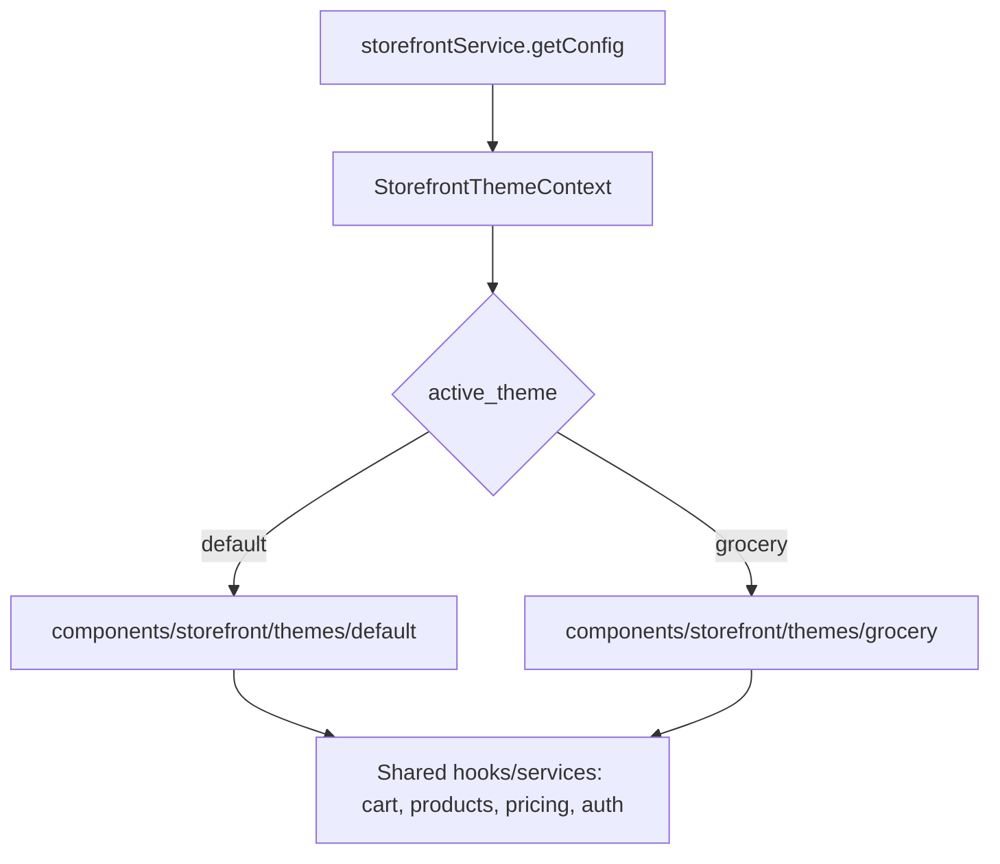

# Storefront Multi-Theme Implementation Plan (Grocery Theme)

Reference UI/UX: https://meenabazaronline.com/

## 1. Goal

Introduce a **selectable storefront theme system**: keep the existing storefront as `"default"`, add a new `"grocery"` theme modeled on meenabazaronline.com, and let an admin switch the *active* theme from the dashboard (Ecommerce → Appearance → Theme & Colors) without deploying code or losing the other theme.

## 2. Reference Site Analysis — meenabazaronline.com

It's a quick-commerce grocery layout:

- **Utility bar**: delivery-area picker ("Select Area · Delivery in 59 min"), sign-in, wishlist count, track-order link
- **Header**: logo, search, category menu trigger, running cart total
- **Category strip**: icon tiles with "New" tag badges (Summer Fruits, Remark Exclusive, Weekend Deals…)
- **Hero**: rotating banner carousel + secondary promo tiles + a countdown-timer flash-sale strip
- **Homepage body**: a long stack of horizontal product rails, one per category ("Popular Picks", "Frozen Items", "Fresh Vegetables", "Fresh Fruits", "Fresh Fish", "Fresh Meat", "Personal Care", "Household", "Kitchenware", "Breakfast"), each with a "See All" link
- **Product card**: image, discount ribbon ("6.0 TK OFF"), unit/weight chip (KG/EACH/500g), name, strikethrough MRP + sale price, add-to-cart, wishlist heart
- **Brand strip**: grid of brand logos
- **Footer**: multi-column link groups, contact block, app-store badges, social icons, copyright

## 3. What Already Exists In This Repo (relevant to reuse)

- `app/(storefront)/store/page.tsx` — current home page (`CategoryStrip`, `HeroCarousel`, product sections)
- `components/storefront/*` — `StorefrontHeader`, `StorefrontFooter`, `HeroCarousel`, `ProductCard`, `MobileBottomNav`, `CartDrawer`, `FloatingCartButton`
- `contexts/ThemeContext.tsx` — **light/dark mode only**, not a layout/skin switcher — needs a separate concept
- `app/(protected)/ecommerce/appearance/theme/page.tsx` — currently a **placeholder stub** (`PageStub`) — this is the natural home for the new theme switcher
- `app/(protected)/ecommerce/appearance/{logo,header-menu,mega-menu,footer,storefront-navigation}` and `app/(protected)/ecommerce/homepage/{banners,categories,featured,flash-sale,hero-slider,trust-badges}` — existing admin sections that already manage storefront content
- Backend `StorefrontConfig` model (table `storefront_configs`, tenant-scoped) — controls header/nav/listing behavior, no theme-key field yet
- `Product` → `ProductVariation` (`selling_price`, `mrp`) gives discount-badge data for free; `Brand.logo_url`, `Category.image_url` already exist for brand strips / category icons

## 4. Data Model Changes (inventory-api)

- Migration on `storefront_configs`: add `active_theme` (string/enum, default `'default'`) and `theme_settings` (JSON — per-theme extras like accent color, whether to show countdown banner, which categories appear as homepage rails and their order).
- Optionally a small `storefront_themes` lookup table (key, label, description, thumbnail_path, is_available) if we want the dashboard to render a theme gallery driven by data rather than a hardcoded list — recommended for future-proofing (adding a 3rd theme later needs no FE redeploy for metadata, only new components).
- No changes needed to `Product`/`Brand`/`Category` for MVP — `mrp` vs `selling_price` already supports discount ribbons, `Brand.logo_url` supports the brand strip, `Category.image_url`/`banner_image` support icon tiles and rail banners.
- New admin-configurable structure for "Homepage Category Rails": ordered list of `{category_id, title_override, product_limit}` (can live in `theme_settings` JSON) so the admin can pick which categories become horizontal rails and in what order — this drives the grocery theme's core homepage pattern.

## 5. Backend API

- Extend `StorefrontConfigController` (or add `StorefrontThemeController`):
  - `GET /api/storefront/config` — add `active_theme` + `theme_settings` to the existing payload.
  - `PATCH /api/storefront-config/theme` (auth + permission-gated, e.g. `ecommerce.appearance.manage`) to set `active_theme` and `theme_settings`.
  - `GET /api/storefront/homepage-rails` — returns configured category rails with products (reuse existing product-listing query logic).
- Cache the active theme per tenant (short TTL) since it's read on every storefront page load; invalidate cache on update.

## 6. Frontend Theme Architecture

- New `contexts/StorefrontThemeContext.tsx` (distinct from the existing light/dark `ThemeContext`) — fetches `active_theme` once per storefront layout, exposes `useStorefrontTheme()`.
- Restructure theme-specific presentational components under:
  - `components/storefront/themes/default/*` (move/wrap current Header, Home sections, Footer, ProductCard as-is)
  - `components/storefront/themes/grocery/*` (new: `GroceryHeader` w/ utility bar, `CategoryIconStrip` w/ tag badges, `CountdownBanner`, `CategoryRail` (horizontal scroll + "See All"), `GroceryProductCard` w/ unit chip + discount ribbon, `BrandStrip`, `GroceryFooter`)
- Both variants implement the **same TypeScript prop contracts** (e.g. `ProductCardProps`, `HeaderProps`) so cart logic, auth state, wishlist, and data-fetching hooks (`useStorefrontCategories`, `useStorefrontStatus`, `storefrontService`) are never duplicated — only presentation differs.
- `app/(storefront)/layout.tsx` and `app/(storefront)/store/page.tsx` become thin switches: read the theme from context/server fetch and render `<DefaultHeader/>`/`<GroceryHeader/>`, `<DefaultHome/>`/`<GroceryHome/>`, etc.
- Support `?preview_theme=grocery` query param (admin-only) so the dashboard can open a live preview of the inactive theme without switching it for real customers.
- Keep dark/light mode (`ThemeContext`) orthogonal — both storefront themes should still respect light/dark tokens where practical.

## 7. Dashboard UI (implement the existing stub)

Replace `app/(protected)/ecommerce/appearance/theme/page.tsx` (currently `PageStub`) with a real page:

- **Theme gallery**: cards for "Default" and "Grocery / Fresh Market" with thumbnail screenshot, description, "Preview" button (opens storefront in new tab with `?preview_theme=`), and "Activate" button (highlights currently active one).
- **Theme settings panel** (shown for the active theme): accent color picker, toggle for countdown/flash-sale banner, toggle for utility bar (grocery only), reorder/select which categories appear as homepage rails (drag-and-drop list reusing pattern from `ecommerce/homepage/categories`).
- Wire to the new `PATCH` endpoint; on save, show a success toast and optionally trigger revalidation of storefront cache/ISR tag.
- Gate the page behind existing ecommerce/appearance permission checks already used by sibling pages.

## 8. New Grocery-Theme Components To Build

| Component | Notes |
|---|---|
| `GroceryUtilityBar` | Sign in / wishlist count / track order links — reuse existing auth/wishlist state |
| `GroceryHeader` | Logo, search, cart total — largely a re-skin of `StorefrontHeader` |
| `CategoryIconStrip` | Icon tiles + optional "New" badge (flag on category or rail config) |
| `CountdownBanner` | Timer bound to nearest active flash-sale end time (flash-sale module already exists) |
| `CategoryRail` | Horizontal scroll-snap product list + "See All" link; generic component parameterized by category id/title/limit |
| `GroceryProductCard` | Adds unit/weight chip + discount ribbon (`mrp` vs `selling_price`) + wishlist heart overlay on top of shared `ProductCard` data contract |
| `BrandStrip` | Grid of `Brand.logo_url` where `is_active` |
| `GroceryFooter` | Multi-column link groups, app-store badges, socials — content sourced from existing footer admin section |

Delivery-area / ETA selector from the reference site is **out of scope for MVP** — it needs a serviceable-area/geo feature not present in the current backend; flag as a Phase 2/optional item.

## 9. Phased Delivery

1. **Foundation**: migration + API for `active_theme`/`theme_settings`; `StorefrontThemeContext`; refactor current storefront into `themes/default/*` (behavior-neutral refactor, verify no regressions).
2. **Dashboard switcher**: implement the real Theme & Colors page with gallery + activate/preview, wired to API (grocery theme can show "Coming soon" initially).
3. **Grocery theme build-out**: implement components in order — header/footer skin → category icon strip → category rails + admin rail configurator → countdown banner → product card variant → brand strip.
4. **Polish & QA**: mobile responsiveness (bottom nav already exists), SEO metadata parity across themes, performance check on multiple rails (lazy-load below the fold), accessibility pass, cross-tenant isolation test (theme is per-tenant).
5. **(Optional, later)** delivery-area/ETA selector if the business wants that quick-commerce feature.

## 10. Open Questions Before Implementation

- Should theme selection be **global per tenant** only, or do you also want per-device/preview override for shoppers (e.g., A/B testing)? Plan above assumes single active theme per tenant with admin preview only.
- Do you have brand/category icon assets ready, or should the grocery theme fall back to emoji icons (as the current `CATEGORY_ICONS` map already does) until real icons are uploaded?
- Is the delivery-area/ETA feature actually wanted, or should it be dropped entirely rather than deferred?
