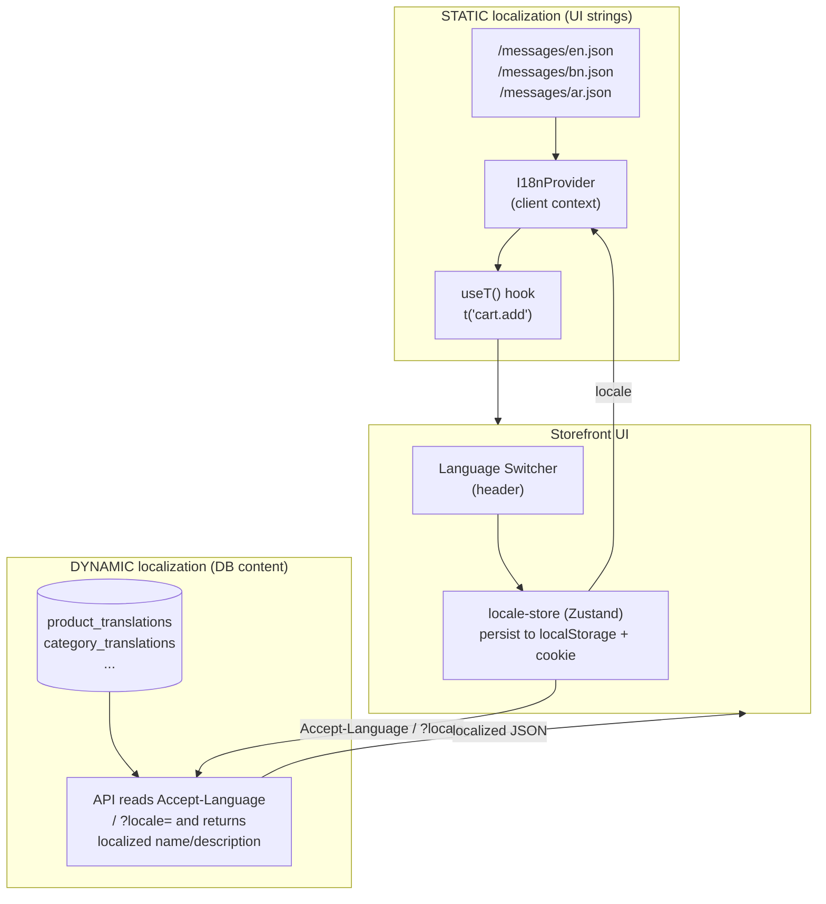
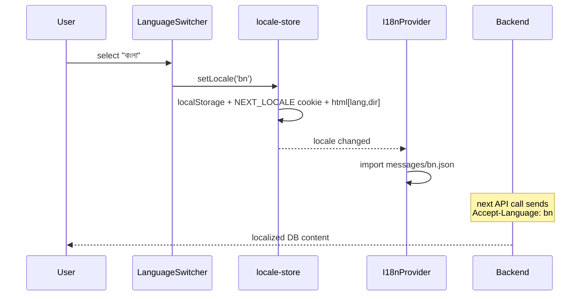
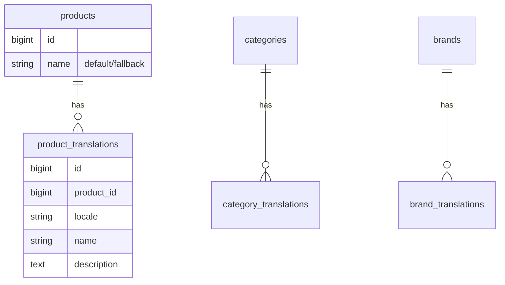
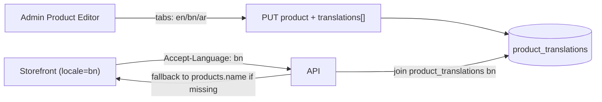

# Internationalization (i18n) & Localization — Implementation Plan

Scope: add multi-language support to the ecommerce storefront (and optionally the
admin dashboard) covering **two distinct problems**:

1. **Static localization** — UI strings baked into the code (buttons, labels,
   menus, validation messages, empty states). Solved with translation catalogs.
2. **Dynamic localization** — merchant-authored, database-backed content
   (product name/description, category name, brand name, CMS/blog, attribute
   values). Solved with a translations table + API locale negotiation.

Current state (verified in repo):
- Frontend: Next.js 16 App Router, **all pages `'use client'`**, no i18n library
  installed, no `next-intl`/`react-intl`. Storefront under `app/(storefront)/`.
- Backend: Laravel with `APP_LOCALE=en`, Symfony translation available but
  unused for API responses. `products` table stores `name`/`description`
  directly (single language, has a FULLTEXT index on `name,description`).
- There is already a "Localization & Currency" settings page
  (`app/(protected)/ecommerce/settings/localization/page.tsx`) that only handles
  currency/tax — **language is not yet handled**. We extend this.

> Because the app is fully client-rendered (`'use client'` everywhere), we use a
> **client-side i18n runtime** (`next-intl` in "without-routing" client mode, or
> `i18next`), NOT the Next.js App-Router server middleware locale routing. This
> matches the existing architecture and avoids a rewrite to Server Components.

---

## 1. Big Picture



**Rule of thumb:** if a human types the text in the admin panel → dynamic
(database). If a developer types the text in code → static (catalog file).

---

## 2. Decisions & Standards (industry-standard choices)

| Concern | Decision | Why |
|---|---|---|
| Locale format | BCP-47 codes: `en`, `bn`, `ar`, `en-US` | Web standard, matches `Accept-Language` |
| Static library | `next-intl` (client provider) or `i18next` + `react-i18next` | Mature, ICU MessageFormat, pluralization |
| Message format | **ICU MessageFormat** | Handles plurals, gender, number/date formatting |
| Catalog location | `messages/{locale}.json`, namespaced by feature | Scales, lazy-loadable |
| Number/currency/date | Native `Intl.NumberFormat` / `Intl.DateTimeFormat` | No extra deps, already used via `toLocaleString` |
| Locale persistence | Zustand store → `localStorage` + `NEXT_LOCALE` cookie | Cookie lets API/SSR read it too |
| RTL support | `dir="rtl"` when locale ∈ {ar, he, fa, ur} | Required for Arabic storefronts |
| DB translations | Separate `*_translations` tables (side-table pattern) | Clean, indexable, avoids JSON bloat, fallback-friendly |
| API negotiation | `Accept-Language` header + `?locale=` override | RESTful, cache-key friendly |
| Fallback chain | requested → tenant default → `en` | Never show blank text |

---

## 3. PART A — Static UI Localization (frontend)

### 3.1 Install & structure
```bash
# in inventory-ui
npm install next-intl --legacy-peer-deps   # repo needs legacy-peer-deps per memory
```
Directory layout:
```
inventory-ui/
  messages/
    en.json
    bn.json
    ar.json
  lib/i18n/
    config.ts        # supported locales, default, RTL list
    I18nProvider.tsx # client provider that loads the active catalog
    useT.ts          # thin re-export of useTranslations
```

### 3.2 Catalog shape (namespaced, ICU)
`messages/en.json`
```json
{
  "common": { "add": "Add", "save": "Save", "loading": "Loading…" },
  "cart": {
    "title": "Your Cart",
    "empty": "Your cart is empty",
    "itemCount": "{count, plural, =0 {No items} one {# item} other {# items}}",
    "addToCart": "Add to Cart"
  },
  "product": { "outOfStock": "Out of stock", "price": "Price" }
}
```
`messages/bn.json` mirrors the exact same keys with Bengali values.

### 3.3 Provider (mount once in storefront layout)
- Create `lib/i18n/I18nProvider.tsx`: reads active locale from the locale store,
  dynamically imports `messages/{locale}.json`, sets `<html dir>` for RTL.
- Wrap children in `app/(storefront)/layout.tsx` (inside `CartFlyProvider`):
  ```tsx
  <I18nProvider>
    {/* existing tree */}
  </I18nProvider>
  ```

### 3.4 Usage in components
Replace hardcoded strings:
```tsx
// before
<button>Add to Cart</button>
// after
const t = useTranslations('cart');
<button>{t('addToCart')}</button>
```

### 3.5 Number / currency / date formatting (standardize)
Create `lib/i18n/format.ts`:
```ts
export const formatCurrency = (n: number, locale: string, currency: string) =>
  new Intl.NumberFormat(locale, { style: 'currency', currency }).format(n);
export const formatDate = (d: Date, locale: string) =>
  new Intl.DateTimeFormat(locale, { dateStyle: 'medium' }).format(d);
```
Replace ad-hoc `toLocaleString(undefined, …)` calls (noted in
`docs/FRONTEND_REVIEW.md`) with these helpers so locale is applied consistently.

### 3.6 Language switcher + store
- `stores/locale-store.ts` (Zustand, persisted): `{ locale, setLocale }`.
  On `setLocale`: write `localStorage` **and** `document.cookie = 'NEXT_LOCALE=…'`
  (so the backend can read it), and update `<html lang>`/`dir`.
- `components/storefront/LanguageSwitcher.tsx`: dropdown in `StorefrontHeader`,
  lists supported locales with native names (English, বাংলা, العربية).



### 3.7 RTL handling
- `config.ts` exports `RTL_LOCALES = ['ar','he','fa','ur']`.
- Provider sets `document.documentElement.dir = RTL_LOCALES.includes(locale) ? 'rtl' : 'ltr'`.
- Audit Tailwind classes: prefer logical utilities (`ms-`, `me-`, `ps-`, `pe-`,
  `text-start`, `text-end`) over `ml-/mr-/text-left` in storefront components so
  layout mirrors correctly.

---

## 4. PART B — Dynamic (DB) Content Localization (backend + frontend)

Target entities: **products, categories, brands, attributes/attribute values,
CMS pages/blog, email templates**. Start with products + categories + brands.

### 4.1 Schema — side-table (translations) pattern
Do **not** add `name_bn`, `name_ar` columns (doesn't scale). Instead one
translation table per entity. Example migration:

```
product_translations
  id
  product_id      (FK -> products.id, cascade delete)
  locale          (string, index)        // 'en','bn','ar'
  name            (string 191)
  description     (text, nullable)
  short_description(text, nullable)
  meta_title / meta_description (nullable)
  UNIQUE(product_id, locale)
  FULLTEXT(name, description)             // per-locale search
```
Repeat: `category_translations`, `brand_translations`,
`attribute_value_translations`.

> Keep the base columns on `products` as the **default-locale fallback** so
> existing data/queries keep working during migration.



### 4.2 Model layer (follow repo Trait convention)
- Add `HasTranslations` trait (`app/Traits/HasTranslations.php`):
  `translations()` relation + `translate(?string $locale)` helper that resolves
  the fallback chain (requested → tenant default → app default) and returns the
  localized attribute, defaulting to the base column when no row exists.
- `Product`, `Category`, `Brand` models `use HasTranslations` and declare
  `$translatable = ['name','description','short_description', ...]`.

### 4.3 Locale resolution middleware
- `app/Http/Middleware/SetLocale.php`: resolve request locale in priority order
  `?locale=` query → `Accept-Language` header → tenant default → `config('app.locale')`,
  validate against a whitelist, then `App::setLocale($locale)`. Register on the
  storefront/api middleware group.

### 4.4 API response transformation
- In storefront resources/controllers (e.g. `StorefrontCatalogController`,
  `StorefrontSearchController`), replace direct `->name`/`->description` output
  with `->translate($locale)->name`, or better, apply it inside an API Resource /
  a `->localize()` accessor so controllers stay thin (matches existing
  ApiResponse/Trait style).
- **Search:** `StorefrontSearchController` currently does
  `MATCH(products.name, products.description)`. For localized search, when locale
  ≠ default, run the FULLTEXT match against `product_translations` for that
  locale (join on `product_id AND locale = ?`), falling back to the base table.

### 4.5 Admin authoring UI (so merchants can translate content)
- Extend product/category/brand edit forms in `app/(protected)/ecommerce/…`
  with a **locale tab strip** (English | বাংলা | العربية). Each tab edits that
  locale's `name`/`description`. Empty locales fall back to default at runtime.
- New endpoints: `PUT /ecommerce/products/{id}/translations/{locale}` (or accept
  a `translations` array in the existing update payload — preferred, fewer
  round-trips).
- Extend the existing **Localization settings page** to manage the tenant's
  **enabled languages** and **default language** (new columns on the
  tenant/ecommerce settings row: `supported_locales` JSON, `default_locale`).



---

## 5. Fallback & Missing-Translation Strategy

```mermaid
flowchart TD
    A["Need text for entity in locale L"] --> B{Translation row\nfor L exists?}
    B -- yes --> C[Return localized value]
    B -- no --> D{Tenant default\nlocale row exists?}
    D -- yes --> E[Return tenant-default value]
    D -- no --> F[Return base column\n(products.name)]
```
- Static side: `next-intl` returns the key or a configured fallback catalog when
  a key is missing — enable `en` as the fallback catalog.
- Log missing dynamic translations (optional) so merchants know what to fill in.

---

## 6. Rollout Order (recommended)

1. **Locale store + config + language switcher** (no visible change yet, just
   plumbing + cookie).
2. **`next-intl` provider + `messages/en.json`** extracted from current UI, wrap
   storefront layout. English-only but now catalog-driven.
3. **Add `bn.json` (or target language)**, translate high-traffic screens first
   (header, product card, cart, checkout).
4. **Standardize currency/date** via `lib/i18n/format.ts`; add RTL logical
   classes audit.
5. **Backend**: `*_translations` migrations + `HasTranslations` trait +
   `SetLocale` middleware (dynamic content, default-locale seeded from base
   columns).
6. **Storefront read path**: localized catalog + search responses.
7. **Admin authoring UI** (locale tabs) + tenant supported/default languages in
   the localization settings page.
8. **QA**: pseudo-localization pass, RTL screenshot review, fallback tests.

---

## 7. Testing & QA

- Unit: `HasTranslations::translate()` fallback chain (has / tenant-default /
  base). `format.ts` currency/date per locale.
- API: request each endpoint with `Accept-Language: bn` and `?locale=ar`, assert
  localized fields and fallback behavior.
- Frontend: Vitest for the switcher + store persistence; snapshot key screens in
  each locale. Pseudo-locale (`en-XA`) build to catch untranslated hardcoded
  strings.
- Accessibility: verify `<html lang>` and `dir` update on switch.

---

## 8. New / Changed Files Summary

**inventory-ui**
- `messages/en.json`, `messages/bn.json`, `messages/ar.json`
- `lib/i18n/config.ts`, `lib/i18n/I18nProvider.tsx`, `lib/i18n/useT.ts`, `lib/i18n/format.ts`
- `stores/locale-store.ts`
- `components/storefront/LanguageSwitcher.tsx`
- edits: `app/(storefront)/layout.tsx` (wrap provider), `StorefrontHeader.tsx`
  (switcher), storefront components (replace hardcoded strings),
  `app/(protected)/ecommerce/settings/localization/page.tsx` (languages),
  product/category/brand editors (locale tabs)

**inventory-api**
- migrations: `*_create_product_translations_table.php`,
  `*_create_category_translations_table.php`, `*_create_brand_translations_table.php`,
  add `supported_locales` / `default_locale` to settings/tenant table
- `app/Traits/HasTranslations.php`
- `app/Http/Middleware/SetLocale.php` (+ register in `bootstrap/app.php`)
- edits: `Product`/`Category`/`Brand` models, `StorefrontCatalogController`,
  `StorefrontSearchController` (localized FULLTEXT), product/category/brand
  update controllers (accept `translations[]`)

---

## 9. Gotchas / Pitfalls

- Don't gate guest redirects on the locale cookie (unrelated to auth, but keep
  cookie names distinct from the session cookie).
- Keep `products.name` UNIQUE constraint in mind — uniqueness is per base row,
  not per translation; translations can legitimately repeat text.
- Cache keys in `StorefrontSearchController`/catalog caching **must include the
  locale**, otherwise one language's response gets served to another.
- `Intl.*` needs the correct BCP-47 tag; map internal `bn` → `bn-BD` etc. if you
  want region-specific number formatting.
- FULLTEXT min token length still applies per-locale; CJK languages may need
  `ngram` parser instead of the default.
