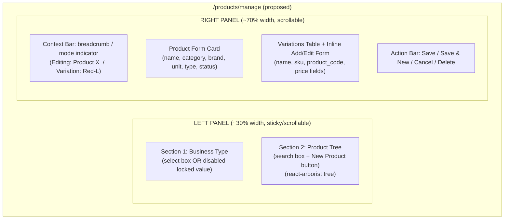
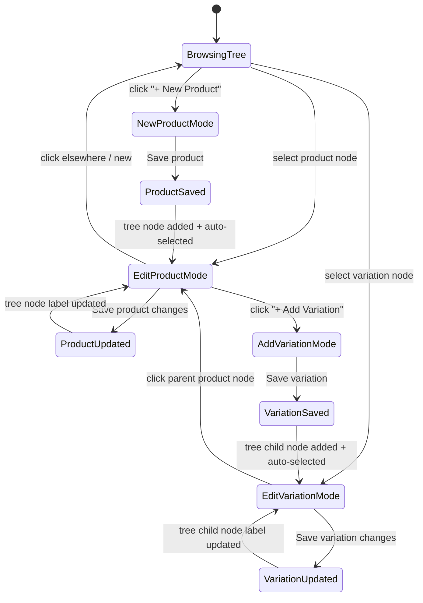
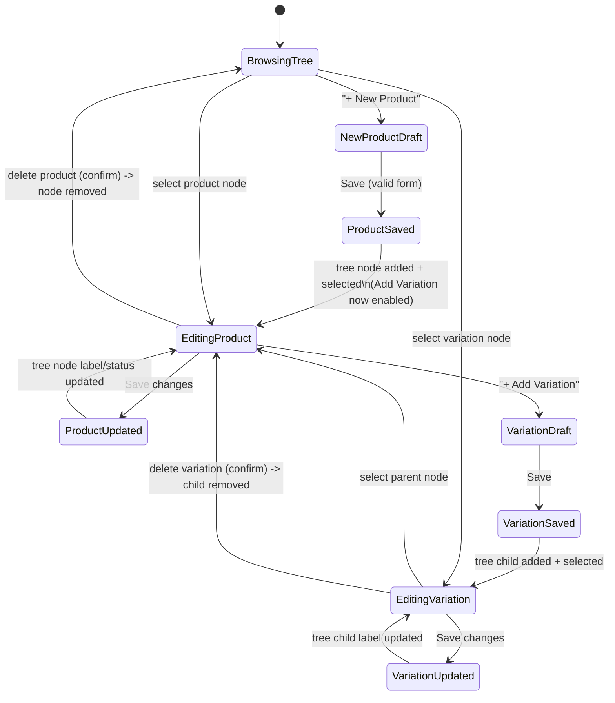
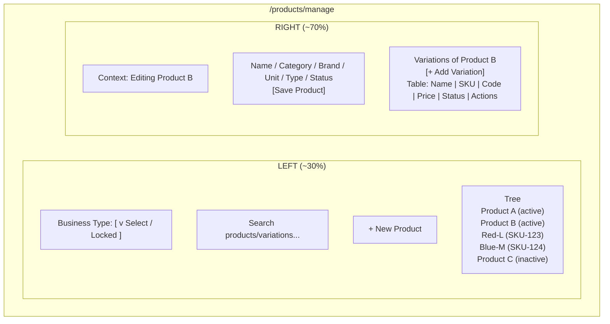

# Unified Product + Variation Management Page — Plan

Route: `/products/manage` (new, separate from existing `/products/add`, `/products/edit/[id]`, `/product-variations/*` which remain unchanged for now).

This document keeps both the original draft proposal (with open questions),
the finalized plan after user confirmation, and a note on the actual
implementation and its revision, for full history/reference.

---

# Part C — Implementation Note (actual build vs. plan)

The first implementation of `/products/manage` used a **Category tree** on
the left (instead of a Product tree) and a right panel that only *browsed*
products/variations in read-only lists, routing to the separate
`/products/add`, `/products/edit`, `/product-variations/add`, and
`/product-variations/[id]/edit` pages for actual data entry. That broke the
core "one page, no navigation, desktop-style" requirement from Part A/B.

**Fix applied:** `components/product-manage/product-detail-panel.tsx` was
refactored to add an inline **form mode**:
- Left panel stays as the Category tree (`CategoryTreePanel`) — used as a
  category filter/browser, not a full product+variation tree. Adopting the
  original react-arborist product/variation tree remains a possible future
  iteration (see Part B open items) but was not part of this revision.
- Right panel now has two modes:
  - **List mode** — search/browse products within the selected category
    (unchanged from before).
  - **Form mode** — inline product form (Name*, Category*, Brand*, Unit,
    Type, Status) + an inline variations table with an inline add/edit row
    (Name, SKU with auto-generate via `productVariationService.generateSku`,
    Product Code, Selling Price, Active toggle). Both product and variation
    CRUD now happen via API calls from this same panel — no route changes,
    matching the "add/update product and variation in one place" goal.
  - "+ Add Variation" is disabled until the product is saved (per confirmed
    decision A.5 #1).
  - Delete (product/variation) still triggers a confirm dialog and refetches
    the list/table in place.
  - Images/Barcodes/Bulk-add still link to their existing dedicated pages
    (out of scope for inline editing).

This satisfies the core UX goal (single-page product + variation entry,
desktop-style) while keeping category-based navigation on the left instead of
a full product/variation tree.

## C.1 Follow-up: dense "Label: [Input]" field layout

Feedback: the stacked "label above input" layout (even in a 2-column grid)
still reads like a mobile/web form, not a desktop app (e.g. .NET WinForms).
Fields such as Category/Brand/Unit/Type/Status took too much vertical space
per field for what should be a tight data-entry form.

**Fix applied:** Introduced a `FormRow` helper in `product-detail-panel.tsx`
that renders each field as a single horizontal row: a fixed-width,
right-aligned label followed by a colon, then the input/select immediately
to its right (`Label: [Input]`), matching classic desktop form conventions.
- Two `FormRow`s per line on wider screens (`grid-cols-2`), Name spans both
  columns since it's the primary field.
- Label width is fixed (`w-16`) so all colons/inputs align vertically like a
  real desktop form.
- Validation error text is indented to align under the input, not the label.
- Same pattern is reusable for any future fields added to this form.

This is a layout/density change only — no new fields, no data model changes.

---

# Part A — Original Draft Proposal (before confirmation)

## A.1 Goal (original)

Make a plan for an add-product + add-variation page where both work together,
desktop-application style, one entry page:
- Left side: tree view of products (using a react-arborist style tree).
- Left side section 1: business type select — locked/disabled for tenant
  login, selectable for super admin.
- Left side section 2: product tree (products with their variations as
  sub-nodes).
- Right side: form with product name, category, brand, unit, type, status
  (pricing/tax fields not needed in UI now, though table columns stay).
- Inputs placed together compactly, like a desktop app, not stacked mobile-style.
- Variation entry: name, price, SKU (auto-generated but editable).
- After insert/save, tree shows product with its variations.
- Selecting a product node shows the product section; selecting a variation
  node shows both product context and that variation's section.
- One place to add/update product + variations simultaneously; every action
  updates the tree node live.
- UI/UX design only — no table structure changes needed at this stage.

## A.2 Original Layout Wireframe

## A.3 Original State Machine Proposal

## A.4 Original Open Questions (asked before implementation)

1. When adding a new product's first variation before the product itself is
   saved — require saving the product first, or auto-save the product
   silently in the background?
2. Should the left tree be searchable/filterable server-side, or is
   client-side filtering of a loaded list acceptable?
3. Do we want drag-and-drop reordering of variations/products in this
   iteration, or defer it?
4. Should deleting a product/variation be available from this same screen
   (right-click/context menu on tree node)?
5. Route: repurpose `/products/add` vs. a new `/products/manage` page — and
   whether old `/products/edit/[id]` / `/product-variations/*` pages should
   be deprecated once this ships?

## A.5 User Answers to Open Questions

1. Insert the product first — no auto-saving. After product insert, the tree
   will show the product. "+ Add Variation" should stay disabled/unavailable
   until the product is saved.
2. Yes — a search option on the left tree is good UX.
3. Drag-and-drop should be included if it's easy to implement.
4. Delete should remove the product or variation from the node; the tree
   should only ever show data that exists in the DB tables.
5. Make a separate route/page for now: `/products/manage`. Old route/files
   remain as-is for now; decide later (after visualizing the new UI/UX)
   whether to keep, merge, or deprecate them.

---

# Part B — Finalized Plan (after confirmation)

## 1. Goal

A single desktop-app-style page to create/edit a product and all its variations
in one place, without page navigation. Left side shows a tree of products and
their variations; right side shows a form that adapts to whatever is selected
in the tree.

## 2. Data Model Recap

**`products`**
- `business_type_id`, `name`, `slug`, `description`
- `category_id`, `brand_id`, `unit_id`
- `type`: simple | variable | composite | digital | service
- `status`: active | inactive | discontinued | archived
- `is_taxable`, `tax_rate` (pricing/tax — column exists, **not shown in this UI for now**)
- `track_inventory`, `allow_backorder`, `low_stock_threshold`, `reorder_point`,
  `has_expiry`, `has_batch`, `has_serial`, `is_featured`, `display_order`, `custom_fields`

**`product_variations`** (belongs to product, cascade delete)
- `product_id`, `sku` (unique), `product_code` (unique, nullable), `name`
- `cost_price`, `selling_price`, `dp`, `mrp` (columns kept, pricing UI de-prioritized)
- `is_active`, `is_default`, `display_order`, `custom_fields`

No schema changes required for this feature.

## 3. Decisions (confirmed)

1. Product must be saved first before adding variations. No auto/silent-save
   of an unsaved product. "+ Add Variation" stays disabled until the product exists.
2. Left tree has a search box (client-side filter over loaded product list).
3. Drag-and-drop reordering is included (react-arborist supports it).
4. Delete removes the product/variation from the DB; tree only ever reflects
   real DB rows (no optimistic nodes left after a delete).
5. Implemented as a new route/page `/products/manage`. Old routes/files stay
   as-is for now; decide later whether to deprecate them.

## 4. Route & File Plan

- `app/(protected)/products/manage/page.tsx` — client component, permission
  gated the same way as existing product pages (`create-product` / `edit-product`).
- `components/products/manage/`
  - `ProductTreePanel.tsx` — left panel: business type select + search + tree + toolbar.
  - `ProductTreeNode.tsx` — custom node renderer (product row vs variation row,
    status dot, drag handle, row actions).
  - `ProductFormPanel.tsx` — right panel product fields.
  - `VariationsPanel.tsx` — variations table + inline add/edit row.
  - `useProductTreeData.ts` — hook that loads tree data and exposes local
    mutation helpers (addProductNode, updateProductNode, addVariationNode,
    updateVariationNode, removeNode) so saves patch state without a full refetch.
- New dependency: `react-arborist` (not yet in `package.json`, needs
  `npm install react-arborist` at implementation time).

## 5. Data Loading Strategy

- On mount: `productService.getProducts({...})` filtered by business type.
  Need to verify at implementation time whether the list endpoint already
  eager-loads `variations`, or whether a `?with=variations` param / a
  dedicated lightweight tree endpoint is needed on the Laravel side (read-only
  concern, no schema change).
- Transform response into react-arborist tree shape:
  `{ id: 'p-<id>', type: 'product', data: product, children: [{ id: 'v-<id>', type: 'variation', data: variation }] }`
- Search box filters the already-loaded tree client-side by product name,
  variation name, or SKU — no extra server round-trip.

## 6. Left Panel — Behavior

**Business Type section**
- Super admin: enabled `BusinessTypeSelect`; changing it refetches the product
  list for that business type and clears current selection.
- Tenant user: same component, disabled/locked, pre-filled from
  `tenantBusinessType` (matches existing `products/add` logic).

**Tree section**
- Toolbar: search input + "+ New Product" button.
- Product node: icon, name, colored status dot (active=green, inactive=gray,
  discontinued=orange, archived=red), chevron to expand variations.
- Variation node (child): icon, name, SKU as secondary/muted text.
- Row hover actions: delete (product or variation) via confirm dialog
  (reuse `sweetalert2`, already a dependency).
- Drag-and-drop: reorder variations within a product (and possibly products
  at root) updates `display_order`; needs a reorder API endpoint — see Open Items.
- Selecting a node drives the right panel; selection stays in sync with
  whatever is being edited on the right.

## 7. Right Panel — Behavior

**Header/context bar**: "New Product" / "Editing: <Product Name>" /
"Variation: <Name> (under <Product Name>)".

**Product Form** (compact desktop-style grid, only these fields):
- Name (required), Category, Brand, Unit, Type, Status.
- Pricing/tax fields intentionally omitted from UI (table columns untouched).
- "Save Product" → `productService.createProduct` / `updateProduct`. On
  success: patch tree (add/update node), select the product node, enable
  "+ Add Variation".
- "+ Add Variation" disabled while product is an unsaved draft.

**Variations Table** (visible once product is selected/saved):
- Columns: Name | SKU | Product Code | Selling Price | Status | Actions.
- "+ Add Variation" opens inline add form: Name, Selling Price, SKU
  (auto-suggested, editable), Product Code (optional).
- SKU auto-suggestion: `slugify(product.name)-slugify(variation.name)`,
  de-duplicated with numeric suffix if needed; editable before save.
- Save → `productVariationService.createVariation` / `updateVariation`;
  patches tree + table row on success.
- Delete → confirm dialog, removes node from tree and row from table.

## 8. State Machine

## 9. Wireframe Reference

## 10. Open Items to Verify at Implementation Time

- Confirm whether `GET /api/v1/products` already eager-loads `variations`,
  or whether a small read-only API change is needed (`?with=variations` or a
  dedicated lightweight tree endpoint).
- Confirm whether a reorder endpoint exists for `display_order` on
  products/variations, or whether one needs to be added for drag-and-drop
  to persist.
- Confirm `productService` / `productVariationService` already expose
  `deleteProduct` / `deleteVariation` methods before wiring delete actions.

## 11. Implementation Order (once confirmed)

1. `npm install react-arborist`.
2. Scaffold `/products/manage` route + permission gate.
3. Build `useProductTreeData` hook (load + local mutate helpers).
4. Build `ProductTreePanel` + `ProductTreeNode` (business type, search, tree, no DnD yet).
5. Build `ProductFormPanel` (product CRUD wired to tree).
6. Build `VariationsPanel` (variation CRUD wired to tree).
7. Wire delete actions with confirm dialogs.
8. Add drag-and-drop reordering (after confirming/adding reorder API if missing).
