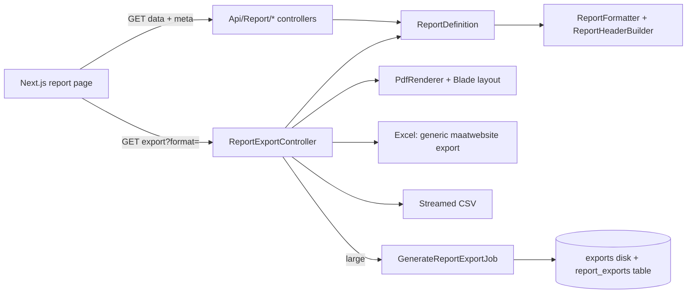

# Report Export & Print Standardization Plan

Scope: a single, global PDF / Excel / CSV / Print system for every report page (Laravel API + Next.js UI), delivered first on `reports/product/stock-status`, which is also redesigned to industry standard.

Status: plan only, no code yet.

---

## 1. Current State and Problems

### 1.1 Frontend (`inventory-ui`)

- `app/(protected)/reports/**` has 46 pages. About 36 follow one pattern (`ReportLayout`, `ReportFilters`, `ReportTable`, `ReportExportBar`), but each repeats the tenant selection and export handler boilerplate.
- All export logic is client-side in `lib/utils/export.ts` and `lib/utils/pdf.ts`:
  - **PDF**: `html2canvas` then `jsPDF` image slicing. Text is not selectable or searchable, quality is poor, and page breaks cut through rows.
  - **Excel**: an HTML table saved as `.xls`. It is not a real `.xlsx`, and Excel shows a format warning.
  - **CSV**: fine, but each page builds its own columns.
  - **Print**: a popup window with `innerHTML` and inline CSS.
- PDF and Print capture only the DOM (the current 25-row page, plus search box and pagination controls), while Excel and CSV use the full dataset. The outputs are inconsistent.
- No report has a company header (logo, name, address, BIN/TIN), "filters applied", "generated by/at", page numbers, or totals.
- `lib/utils/format.ts` hard-codes BDT, `en-BD` and `en-GB`. It ignores the tenant currency, timezone and date format.
- One-offs and gaps: `purchase-list` (own jsPDF layout), `balance-sheet` and `trial-balance` (hand-rolled CSV), `cash-flow`, `ledger` and `profit-loss` (no export), `pos/session-summary` (partial).
- `ReportService.exportReport()` exists but nothing calls it.

### 1.2 Backend (`inventory-api`)

- One 500+ line `Api/ReportController` calls the static `ReportTrait` methods.
- `ReportExportService` has a static registry, but it is broken:
  - There are no Blade views, so every PDF export throws.
  - Excel falls back to CSV when there is no export class. Only `StockValuationExport` and `StockAgingExport` exist, each with hard-coded columns.
  - Paginated reports return a paginator, so exports are empty.
  - `ReportTrait::export()` calls a non-existent method.
- The export route uses the generic `view-reports` permission and raw params. It is synchronous with no throttle or queue.
- `reportTenantId()` ignores the `tenant_id` request param, so the super-admin tenant selector does nothing.
- Stock-status maps to `lowStockReport`. It returns only low-stock rows, with a different shape from what the UI expects (`product_name`, `on_hand`, `status`, `value` and the summary counts). The page shows wrong or empty data.
- Low stock uses `min_quantity` while the reorder report uses `reorder_point`, so the meaning is inconsistent.

### 1.3 Root cause

Columns and formatting are defined separately in the UI table, the client export and the backend Export class. There is no shared report definition and no shared document layout.

---

## 2. Target Architecture

Principle: **one report definition on the server is the single source of truth**. It supplies the query, the columns, the summary and the filters. The JSON API, the UI table, PDF, Excel, CSV and Print all consume it.



Decisions:

1. **All exports are generated on the server** from the full filtered dataset. This gives selectable-text PDFs, real `.xlsx`, and identical data across formats.
2. **Print = PDF preview.** The UI shows the server PDF in a preview modal and prints that. Print therefore matches the PDF exactly, and `window.open` and `innerHTML` printing are removed.
3. **The client stops generating files.** `html2canvas`, the fake `.xls` and the popup print are removed once all reports are migrated.
4. **Multi-tenant safe.** The tenant is resolved in exactly one place and is enforced for every format.

---

## 3. Backend Plan (Laravel)

### 3.1 Controller layout

Follow the existing sub-folder convention (`Api/Ecommerce`, `Api/Storefront`, `Api/Import`). The monolithic `Api/ReportController.php` is replaced by a `Report` folder.

```
app/Http/Controllers/Api/Report/
  BaseReportController.php        (abstract: tenant resolution, filter validation, JSON response)
  InventoryReportController.php   (stock-valuation, aging, abc, dead-stock, reorder, low-stock, movement, adjustment, batch-expiry, shrinkage, turnover)
  ProductReportController.php     (stock-status, profitability, price-list)
  SalesReportController.php       (by-product, by-customer, by-category, salesperson, profit-margin, return-analysis, trend)
  PurchaseReportController.php    (po-summary, supplier-performance, by-supplier, grn-register, purchase-return)
  PosReportController.php         (daily-sales, session-summary, cashier, hourly, payment-breakdown, refund-summary)
  AccountingReportController.php  (tax-return, tax-summary, cash-flow-forecast, budget-vs-actual, vat-return, ar/ap aging wrappers)
  CustomerReportController.php    (aging, profitability, statement)
  SupplierReportController.php    (statement, aging, scorecard)
  WarehouseReportController.php   (stock-summary, bin-utilization, transfer)
  SystemReportController.php      (audit-log, activity-log, alert-history, user-activity, commission)
  ReportExportController.php      (export, export status, download: one place for every format)
  ReportMetaController.php        (column/filter metadata for the UI)
```

Rules:
- Controllers are thin: validate through a Form Request, resolve the definition, return the result. No queries in controllers.
- Namespace `App\Http\Controllers\Api\Report`. Routes in `routes/route/reports.php` are updated to the new classes. Route URLs are **unchanged**, so the UI keeps working during the migration.
- The old `ReportController` is deleted after the last route moves. During migration it can proxy to the new classes.
- Form Requests go under `app/Http/Requests/Report/` (`StockStatusRequest`, and so on), all extending a `BaseReportRequest` that validates `tenant_id`, `warehouse_id`, `date_from`, `date_to`, `page`, `per_page`, `sort`, `dir`, `search`.

### 3.2 Report definitions (single source of truth)

```
app/Reports/
  Contracts/ReportDefinition.php   (interface)
  AbstractReport.php               (shared: tenant scope, sort, search, paginate/cursor)
  ReportRegistry.php               (key -> definition; replaces the static $registry in ReportExportService)
  Columns/Column.php               (value object)
  Inventory/StockStatusReport.php  (first one)
  Inventory/StockValuationReport.php ...
```

A definition declares:

| Member | Purpose |
|---|---|
| `key()` | e.g. `product/stock-status` |
| `title()`, `subtitle()`, `code()` | Report title and document code (e.g. `RPT-PRD-001`) |
| `permission()` | Per-report view permission (`view-stock-status-report`) |
| `columns()` | List of `Column(key, label, type, align, width, format, total, exportable, printable)` |
| `filters()` | Declared filters (type, options source, default) for the UI and the "Filters applied" block |
| `query(filters)` | An Eloquent/Query Builder query, **not** an array, so it can be chunked or streamed |
| `summary(filters)` | KPI values shown in cards and in the PDF/Excel summary strip |
| `totals(filters)` | Grand totals row (from SQL aggregate, not from the paged rows) |
| `orientation()`, `paper()` | Defaults (A4 landscape for wide tables) |
| `maxSyncRows()` | Threshold before switching to a queued export |

Column `type` values: `text`, `integer`, `quantity`, `money`, `percent`, `date`, `datetime`, `badge` (status), `boolean`. The type drives the UI cell renderer, the Excel number format, the PDF alignment and the CSV raw value in one place.

### 3.3 Shared services

```
app/Services/Report/
  ReportHeaderBuilder.php   (tenant profile: name, logo, address, phone, email, BIN/TIN/VAT, currency, timezone)
  ReportFormatter.php       (money/quantity/date formatting from tenant settings; one implementation)
  ReportExporter.php        (orchestrator: choose sync vs queued, filename, headers)
  Pdf/PdfRenderer.php       (interface) + DompdfRenderer.php
  Excel/GenericReportExport.php   (maatwebsite: FromQuery, WithMapping, WithHeadings, WithColumnFormatting, WithEvents, WithCustomStartCell, ShouldAutoSize)
  Csv/CsvStreamer.php       (streamed response, chunked)
```

`ReportHeaderBuilder` reads `Tenant` (business_name, address, city, country, phone, email, tin_number, bin_number, vat_number, currency, timezone, logo_url) and `TenantSetting` (date/time format, currency position, print preferences). It also adds generated-by (user), generated-at (tenant timezone) and the human-readable filters-applied text.

### 3.4 Global configuration

New `config/reports.php` (single place to change the look and limits for every report):

- `paper` (`A4`), default `orientation`, `margins`, base font size, table font size.
- `brand` (primary colour, zebra colour, header fill, badge colours for in-stock, low, out and over).
- `fonts`: bundled font family with the `৳` sign and Bangla glyph coverage (see risk in section 8).
- `limits`: `pdf_sync_rows` (e.g. 3,000), `excel_sync_rows` (e.g. 20,000), `csv_stream` (no cap, streamed), `queue_threshold`, `hard_max_rows`.
- `throttle` for the export route, `retention_days` for generated files, `disk` (`exports`).
- `filename` pattern: `{tenant-slug}_{report-key}_{YYYYMMDD-HHmm}.{ext}`, sanitized.
- Defaults for date format, number format and currency symbol position, used only when tenant settings are missing.

`config/filesystems.php` gets a private `exports` disk (`storage/app/private/exports/{tenant_id}/`).

### 3.5 Blade templates for PDF

```
resources/views/reports/
  layouts/report.blade.php        (page CSS, @page margins, running header/footer, page X of Y)
  partials/header.blade.php       (logo, business name, address, contacts, BIN/TIN)
  partials/title.blade.php        (title, subtitle, date range/as-of)
  partials/filters.blade.php      (filters applied)
  partials/summary.blade.php      (KPI strip)
  partials/table.blade.php        (generic renderer driven by columns())
  partials/footer.blade.php       (generated by/at, report code, page numbers)
  generic.blade.php               (layout + partials; used by every report by default)
```

A report only needs its own view if it has an unusual layout (statements, invoices, hierarchical trial balance). Most reports use `generic.blade.php`.

### 3.6 Endpoints (URLs stay stable)

| Endpoint | Behaviour |
|---|---|
| `GET /api/v1/reports/{cat}/{name}` | JSON. Server-side pagination (`page`, `per_page`), `sort`, `dir`, `search` and filters. Returns `{ data, meta:{page,per_page,total}, summary, totals, columns, filters_applied, generated_at }` |
| `GET /api/v1/reports/{cat}/{name}/meta` | Columns, filter definitions and options, defaults, permissions, so the UI can render without hard-coding |
| `GET /api/v1/reports/{cat}/{name}/export?format=pdf\|xlsx\|csv&orientation=&paper=&columns=` | Small result: streamed file (`200`). Large result: `202` with `{export_id}` |
| `GET /api/v1/reports/exports/{id}` | Status: `queued / processing / ready / failed`, progress, rows |
| `GET /api/v1/reports/exports/{id}/download` | Signed, tenant-checked download; expires |

Permissions: view uses the per-report permission; export additionally requires `export-reports`. Both are checked for the tenant. Rate limit with `throttle:report-export`.

### 3.7 Queued exports

- `GenerateReportExportJob` (queue `reports`) handles anything above the sync threshold.
- New `report_exports` table: `id`, `tenant_id`, `user_id`, `report_key`, `format`, `filters` (json), `options` (json), `status`, `file_path`, `file_size`, `rows`, `error`, `started_at`, `finished_at`, `expires_at`.
- A scheduled command deletes expired files and rows (`retention_days`).
- The UI polls the status endpoint and starts the download when ready.

### 3.8 Format specifications

**PDF**
- A4, landscape by default for wide tables (portrait selectable), margins from config.
- Header on page 1: logo, business name, address, phone/email, BIN/TIN/VAT. A compact running header on later pages.
- Title block: report title, as-of date or date range, filters applied (readable text, not codes).
- Summary strip (KPIs), then the table with a repeating `thead` on every page, zebra rows, right-aligned numeric columns, status shown as coloured text or badge, no rows split across pages.
- Totals row at the end (grand totals from SQL, not from the paged rows).
- Footer on every page: report code, generated by, generated at (tenant timezone), "Page X of Y".
- Selectable, searchable text. PDF metadata (title, author, creator).

**Excel (`.xlsx`, real)**
- Title block rows (business, report title, filters, generated at/by), then a header row and data.
- Numbers, money and dates written as real typed cells with number formats (not text), so sorting, filtering and pivoting work.
- Frozen header row, auto-filter, auto width (capped), bold styled header, zebra optional, totals row with `SUM` formulas or exact values.
- Print setup: landscape, fit to 1 page wide, repeat header row, footer with page numbers.
- Sheet name from the report title (31 char safe). Document properties set.
- Large exports use chunked `FromQuery`. No array building of all rows in memory.

**CSV**
- Streamed, UTF-8 with BOM (so Excel opens Bangla text correctly), RFC 4180 quoting, comma delimiter.
- Header row plus data rows only (no title block), machine-friendly: raw numbers without thousands separators or currency symbols, ISO dates.
- Formula-injection guard: values starting with `= + - @` are prefixed with `'`.
- Same column order and labels as the report definition.

**Print**
- Print is the server PDF opened in the preview modal (section 4.3). No separate HTML print stylesheet to maintain.

### 3.9 Bugs and inconsistencies to fix on the way

1. The tenant resolver honours `tenant_id` for super admins only (same rule as `DashboardController` and `StockController`). Regular users are always forced to their own tenant.
2. The paginated reports (stock-movement, audit-log, activity-log) export correctly (the exporter reads the query, not a paginator).
3. Remove the non-existent `ReportTrait::export()` call and the static registry. `ReportTrait` logic moves into definitions incrementally, one report at a time, with the old method kept until each route is migrated.
4. Clarify `low-stock` versus `reorder` (section 5.2) so the two reports use one shared status rule.

---

## 4. Frontend Plan (Next.js)

### 4.1 Shared building blocks

```
components/reports/
  ReportPage.tsx               (composition: header, tenant select, filters, KPI cards, table, export menu)
  ReportHeaderBar.tsx          (title, breadcrumbs, "As of" timestamp, refresh, export menu)
  ReportExportMenu.tsx         (dropdown: PDF, Excel, CSV, Print Preview + options popover)
  ReportPrintPreviewModal.tsx  (iframe with the server PDF, Print / Download / Close)
  ReportExportProgress.tsx     (toast/progress for queued exports)
  ReportTable.tsx              (existing, extended: server pagination/sort, column visibility, sticky header, totals footer, density)
  ReportFilters.tsx, ReportSummaryCards.tsx, ReportEmptyState.tsx (existing, kept)
hooks/reports/
  use-report-query.ts          (SWR, server pagination, sort, search, filters in URL query string)
  use-report-export.ts         (calls export endpoint, handles 200 blob vs 202 polling, download, errors)
  use-report-tenant.ts         (removes the isSuperAdmin/selectedTenantId boilerplate)
services/
  reportService.ts             (generic: get(cat,name,params), meta(), export(), exportStatus(), downloadUrl())
lib/reports/
  format.ts                    (money/qty/date using tenant settings; replaces hard-coded BDT/en-GB)
  types.ts                     (ReportColumn, ReportMeta, ReportResponse, ExportFormat, ExportOptions)
```

Behaviour:
- **Columns come from `meta`**, so adding a report column is a backend-only change.
- **Filters are kept in the URL** (shareable, survives refresh, and the back button works).
- **Export uses exactly the filters, sort and search currently applied**, and the full dataset (not the visible page).
- Export menu options: orientation, paper size, "include summary", column picker (default all printable columns). Choices are remembered per user in local storage.
- Buttons are disabled while exporting and show progress. Errors show a clear toast with retry. Permission `export-reports` gates the menu.
- Print preview: fetch the PDF as a blob, show it in an iframe in a modal, and call `iframe.contentWindow.print()` from the Print button. Fallback: open the blob URL in a new tab if the iframe print is blocked.

### 4.2 Removal after migration

- Delete `exportToPDF`, `exportToExcel`, `printReport` and `lib/utils/pdf.ts`, and drop `html2canvas` and `jsPDF` if no other module uses them (invoice/receipt printing must be checked first). Keep `downloadBlob`.
- Remove the per-page export handlers, the hand-rolled CSV code in `balance-sheet`/`trial-balance`, and the custom jsPDF code in `purchase-list`.
- Replace `lib/utils/format.ts` usage in reports with `lib/reports/format.ts`.

### 4.3 Stock Status page redesign (`reports/product/stock-status`)

**Layout (top to bottom)**

1. **Header bar**: breadcrumb (Reports / Product / Stock Status), title, "Data as of {date time}", Refresh, and the **Export menu** (PDF, Excel, CSV, Print Preview).
2. **KPI cards** (clickable, they apply the matching status filter):
   - Total SKUs
   - In Stock
   - Low Stock
   - Out of Stock
   - Overstock (if `max_quantity` is set)
   - Total Units on Hand
   - Stock Value at Cost
   - Stock Value at Retail (and potential margin)
3. **Status distribution**: a stacked bar or donut (recharts) of In / Low / Out / Overstock counts. Optional second chart: stock value by category (top 10).
4. **Filter bar**:
   - Search (product name, SKU, barcode)
   - Warehouse
   - Category (tree select)
   - Brand
   - Status chips: All, In Stock, Low, Out, Overstock (multi-select)
   - Product type / "track inventory only"
   - Include inactive (toggle)
   - Tenant select (super admin only)
   - Apply and Reset; active filters shown as removable chips
5. **Table** (all products with their stock data, not only low stock):

   | Column | Notes |
   |---|---|
   | # | Row number |
   | Product | Name, with variation name beneath |
   | SKU | Monospace |
   | Category | |
   | Warehouse | |
   | Unit | |
   | On Hand | Quantity |
   | Reserved | Quantity |
   | Available | On hand minus reserved |
   | Reorder Point | |
   | Max | Optional |
   | Avg Cost | Money |
   | Stock Value | Money (cost) |
   | Retail Value | Money, optional (hidden by default) |
   | Last Received / Last Sold | Date, optional (hidden by default) |
   | Status | Badge: In Stock (green), Low (amber), Out (red), Overstock (blue) |

   Features: server-side pagination (25/50/100), sortable columns, sticky header, column visibility toggle, row density toggle, totals footer (page total and grand total), status-tinted row accent, responsive horizontal scroll on small screens, skeleton loading, empty state, error state with retry.
6. **Accessibility and polish**: badges use text plus colour (not colour alone), keyboard-operable filters and menus, ARIA labels on the export menu, print-friendly focus states.

**Data rules**
- The report lists **every product variation** that tracks inventory, per warehouse. A product with no stock row is shown as `0` and **Out of Stock** (left join, not inner join).
- Status rule (one definition shared with the `low-stock` and `reorder` reports):
  - `out_of_stock`: `quantity <= 0`
  - `low_stock`: `quantity > 0` and `quantity <= COALESCE(NULLIF(reorder_point, 0), min_quantity)`
  - `overstock`: `max_quantity > 0` and `quantity > max_quantity`
  - `in_stock`: everything else
  - The rule is confirmed in section 9, Q1.
- `available = quantity - reserved_quantity`.
- Cost: `stocks.average_cost`, falling back to `variation.cost_price`, then `product.cost_price`. Retail value uses `variation.selling_price`.
- Summary counts, totals and the grand total row are SQL aggregates over the whole filtered set, not the visible page.

**Backend for this page**
- New `Report\ProductReportController@stockStatus` + `StockStatusRequest` + `Reports\Inventory\StockStatusReport`.
- Filters: `tenant_id`, `warehouse_id`, `category_id`, `brand_id`, `status[]`, `search`, `product_type`, `include_inactive`, plus `sort`, `dir`, `page`, `per_page`.
- Response matches the contract in section 3.6. This also fixes the current mismatch between the UI and `lowStockReport`.
- `inventory/low-stock` and `inventory/reorder` reuse `StockStatusReport` with a preset status filter, removing the duplicated logic.

**Stock-status PDF/Excel specifics**
- Title "Stock Status Report", subtitle "As of {date time}", filters-applied line (warehouse, category, status).
- Summary strip: total SKUs, in/low/out/overstock counts, total quantity, stock value.
- Status column coloured in the PDF, and a real text value ("In Stock", "Low Stock", ...) in Excel and CSV (CSV also carries a machine `status` code column if needed).
- Landscape A4, about 12 printable columns, totals row at the end.

---

## 5. Cross-Cutting Standards

### 5.1 Formatting

- One formatter on each side, both driven by tenant settings: currency code and symbol position, decimal places, thousand separator, date format, time format, timezone.
- Backend `ReportFormatter` for PDF. Excel uses typed cells with number formats. CSV uses raw values. Frontend `lib/reports/format.ts` for the on-screen table.
- Negative numbers use a leading minus (or red in the UI/PDF), zero shows `0` (not blank), and null shows `-`.

### 5.2 Naming

- Files: `{tenant-slug}_{report-key}_{YYYYMMDD-HHmm}.{pdf|xlsx|csv}` (sanitized, no user-controlled path parts).
- Report code in the footer, e.g. `RPT-PRD-001`, defined in the report definition.

### 5.3 Security

- Tenant isolation is enforced in the query for every format, and the queued job re-checks the tenant and the user.
- Per-report view permission plus `export-reports`. Signed, expiring download URLs. Files live on a private disk and are never public.
- CSV/Excel formula-injection guard. Filenames and sheet names sanitized. Request validation through Form Requests only (no raw params).
- Rate limit and a hard max row cap on exports. Audit-log each export (user, report, filters, format, rows).

### 5.4 Performance

- Queries return builders and use `chunkById` or cursor for exports, so memory stays flat.
- Summary and totals come from aggregate queries. Add or verify indexes on `stocks(tenant_id, warehouse_id, product_id, variation_id)`.
- Keep the existing short-lived cache (about 5 minutes) for summary/KPI queries only, keyed by tenant and filters.

---

## 6. Rollout Phases

**Phase 0: Foundation (backend)**
- `config/reports.php`, `exports` disk, `report_exports` table, `ReportDefinition` contract, `Column`, `ReportRegistry`.
- `ReportHeaderBuilder`, `ReportFormatter`, `PdfRenderer` (dompdf), generic Excel export, CSV streamer, Blade layout and partials.
- `Api/Report/*` controllers scaffolded, `BaseReportController` (with the tenant fix), `ReportExportController`, `ReportMetaController`, the job and cleanup command.

**Phase 1: Stock Status (end to end)**
- `StockStatusReport` definition, request, controller, route, tests.
- Frontend shared components and hooks (section 4.1), then the redesigned stock-status page.
- Verify all four outputs on real tenant data, including Bangla names and the `৳` sign.

**Phase 2: Inventory group**
- Migrate stock-valuation, stock-aging, abc-analysis, dead-stock, reorder, low-stock, stock-movement, stock-adjustment, batch-expiry, shrinkage, turnover, warehouse reports.

**Phase 3: Remaining groups**
- Sales, purchase, POS, customer, supplier, accounting (including the three pages with no export, and the `purchase-list`, `balance-sheet`, `trial-balance` one-offs, which may need report-specific Blade views), system reports.

**Phase 4: Cleanup**
- Delete the old `ReportController`, `ReportExportService` static registry, `lib/utils/export.ts` report functions, `lib/utils/pdf.ts` (after checking other users), the old `ReportExportBar`, and unused dependencies.

Each phase leaves the app working: the old route URLs stay, and a page switches only when its definition is migrated.

---

## 7. Testing and Acceptance

**Backend (PHPUnit/Pest)**
- Contract test for every registered report: `columns()` keys exist in the query result, permissions enforced, tenant isolation holds (tenant A cannot read or export tenant B), a non-super-admin cannot override `tenant_id`.
- Stock status: correct status for each edge case (no stock row, zero, exactly at reorder point, overstock, reserved greater than on hand), summary equals the sum of rows, filters combine correctly.
- Export tests: PDF is generated and non-empty, `.xlsx` opens with correct typed cells, header and totals, CSV has BOM, correct quoting and injection guard, queued path returns `202`, then the file downloads, expired links are rejected.

**Frontend (Vitest + manual)**
- `use-report-export` (200 and 202 flows, error handling), `ReportExportMenu` permission gating, filter-to-URL sync.
- Manual print QA matrix: Chrome, Edge, Firefox; A4 portrait and landscape; 1 page, many pages, and empty result.

**Acceptance criteria**
1. Stock Status lists all products with the correct status, and the summary matches the table.
2. PDF, Excel, CSV and Print Preview contain the same rows and totals as the screen for the same filters, across all pages of data (not just the visible page).
3. PDF and Excel show the tenant header (logo, name, address, BIN/TIN), filters applied, generated by/at, page numbers.
4. Excel is a real `.xlsx` with typed numeric cells, frozen header, filter and print setup.
5. CSV opens correctly in Excel with Bangla text and is safe from formula injection.
6. Adding a new report needs only a definition class plus a route. No new export or print code.
7. No report page contains its own export or print implementation.

---

## 8. Risks and Mitigations

| Risk | Mitigation |
|---|---|
| dompdf does not shape Bengali conjuncts correctly, so Bangla product names may render wrongly | Verify early in Phase 1 with real names. Keep `PdfRenderer` behind an interface so mPDF or headless Chromium (Browsershot) can replace it without touching reports |
| The `৳` glyph may be missing in default dompdf fonts | Bundle a font that includes it (e.g. Noto Sans family) and register it in `config/reports.php` |
| Very large exports time out | Sync thresholds plus the queued path, streamed CSV, chunked Excel |
| Migrating 46 pages at once is risky | Phased rollout, stable route URLs, per-report switch-over |
| Inconsistent low-stock rules change numbers users are used to | Decide the rule with the business (Q1) and document it on the report page |
| Removing `html2canvas`/`jsPDF` breaks invoice/receipt printing | Check usages first, and remove them only in Phase 4 if unused |

---

## 9. Open Questions (need a decision before coding)

1. **Low-stock rule**: use `reorder_point`, falling back to `min_quantity` (proposed), or `min_quantity` only?
2. Should **overstock** be a separate status, or shown only when `max_quantity` is set (proposed)?
3. Is a **Bangla-language PDF** needed now? This decides the renderer (dompdf, mPDF or Chromium).
4. Sync export limits: are the proposed thresholds acceptable (PDF 3,000, Excel 20,000 rows, then queued)?
5. Should each export **be audit-logged** and visible to admins (proposed: yes)?
6. Should exported files be **kept for download history** (proposed: 7 days), or deleted right after download?
7. Is a **per-tenant report branding** option required (accent colour, footer text), or is the logo and business header enough?
