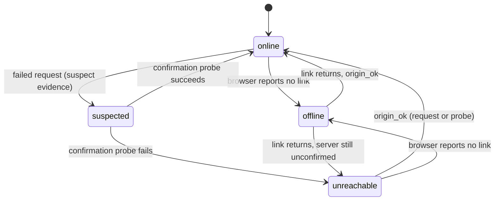

# V2: Offline / Network Error Detection (Plan)

Status: **implemented**. See [OFFLINE_NETWORK_DETECTION.md](OFFLINE_NETWORK_DETECTION.md)
for the shipped design. This document is kept as the rationale and review record.

Phases 1, 2 and 4 are done. Phase 3 (leader election, cross-tab sharing) was
deliberately left out — open decision 3 below asks whether it is needed, and
jitter plus the health route's rate limit absorb the cost for now.

**What shipped**

| Phase | Scope | Where |
| --- | --- | --- |
| 1 | Origin marker, health route, rate limit, backend tests | `inventory-api`: `App\Constants\ApiOrigin`, `App\Http\Middleware\AddApiOriginMarker`, `App\Http\Controllers\Api\HealthController`, `tests/Feature/ApiOriginMarkerTest.php` |
| 2 | Evidence classifier, reducer, three-valued reachability, `reason`, confirmation probe, jitter, visibility pause, long-running opt-out, three copy variants | `inventory-ui`: `lib/api/network-error.ts`, `stores/network-store.ts`, `lib/api/network-monitor.ts`, `lib/api/axios.ts`, `hooks/use-offline.ts`, `components/layout/offline-banner.tsx` |
| 3 | Leader election, cross-tab sharing, staggered SWR revalidation | **Not implemented** — see open decision 3 |
| 4 | This document superseded by `OFFLINE_NETWORK_DETECTION.md` | — |

**Rollout note (dependencies section).** The plan warned that the frontend must
not require the marker before the backend ships. The implementation keeps that
safe: for *app requests*, a missing marker on an otherwise-valid JSON response is
tolerated rather than treated as foreign, so the frontend works against an
un-upgraded backend. The *probe* still requires `200` + marker, which means an
un-upgraded backend produces a permanently failing probe — degraded to
"recovery depends on user-initiated requests" rather than a permanently visible
banner. Deploy the backend first to get the full behaviour.

**Deviations from the plan, and why**

- **Section 3.3 three-valued reachability was implemented as planned**, but note
  `deriveStatus` maps `unknown` to `online`. When the link returns there is no
  evidence either way, and announcing an outage from an absence of evidence is
  the bug being fixed. The engine probes immediately on `browser_online`, so the
  real state arrives within one round trip.
- **`origin_ok` while the link is down is ignored entirely** (not merely
  status-preserving). This is stronger than the plan's wording but is what makes
  the "offline implies not reachable" invariant true by construction.
- **The health route is `no-store`.** Not in the plan, but a cached probe success
  would mask an outage and a cached failure would outlive the recovery it exists
  to detect.

This replaces the detection rules in [OFFLINE_NETWORK_DETECTION.md](OFFLINE_NETWORK_DETECTION.md). The V1 architecture (pure classifier, one store, one engine module, banner, `useOffline`) is kept. V2 changes what counts as evidence, how the state is modelled, and how a failure is confirmed.

---

## 1. Why V2

V1 asks one question: did the server answer? Any HTTP response counts as "reachable". In this app that question is wrong for the scenario V1 was written for.

The browser never talks to Laravel directly. It talks to the Next.js server, which proxies `/api/*` and `/sanctum/*` to the backend through rewrites in [next.config.mjs](../next.config.mjs). So when Laravel is down:

- The browser still gets an HTTP response, from the Next.js proxy (a 5xx) or from Laravel in maintenance mode (a 503).
- V1 classifies both as "server reachable", so the banner never shows and the recovery probe reports recovery while the backend is still dead.
- A captive portal that answers every URL with `200 text/html` also counts as reachable.

The correct question is: **did Laravel answer?**

### Findings from the V1 review that V2 also fixes

| # | V1 problem | Where |
| --- | --- | --- |
| 1 | Gateway and proxy errors count as "reachable"; the probe accepts any status | `lib/api/network-error.ts`, `lib/api/network-monitor.ts` |
| 2 | Documented invariant "offline implies not reachable" is false in code | `stores/network-store.ts` (`markReachable`) |
| 3 | `changedAt` is re-stamped while the status does not change, which resets banner dismissal | `stores/network-store.ts` (`markReachable`) |
| 4 | 4xx and 5xx responses never mark the server reachable, despite the comment saying they do | `lib/api/axios.ts` |
| 5 | Probe uses the authenticated `/api/v1/user`, so every probe is a logged 401 | `lib/api/network-monitor.ts` |
| 6 | One timed-out request (for example a slow report) can flag the whole app as unreachable | `lib/api/network-error.ts` |
| 7 | Backoff has no jitter, so every client probes in lockstep after a restart | `lib/api/network-monitor.ts` |
| 8 | Doc says `axios.ts` changed by "3 lines" and refers to `next.config.ts` | docs and comments |

---

## 2. Principles

1. **Evidence, not assumption.** A status is only derived from an observation. When there is no observation, the state is "unknown", not "fine" and not "down".
2. **Verify before announcing.** A single failed request is a suspicion. The banner appears only after a confirmation probe also fails.
3. **Origin-aware.** A response only proves reachability if it demonstrably came from Laravel.
4. **One writer.** All state changes go through one reducer, so invariants and `changedAt` rules are enforced in one place.
5. **Never block on a guess.** The UI never prevents a write based on a suspected failure. Only the browser's own "no link" signal is trusted enough to gate actions.
6. **Cheap when healthy.** Zero background requests while healthy. This V1 rule stays.

---

## 3. Detection model

### 3.1 Evidence kinds

Each completed request, and each probe, is classified into exactly one kind.

| Kind | Definition | Effect |
| --- | --- | --- |
| `origin_ok` | Any response carrying the Laravel origin marker (any status, including 401, 404, 422, 500) | Reachable |
| `gateway_failure` | 502, 503 or 504 without the marker, or a 5xx whose body is not JSON | Suspect unreachable |
| `no_response` | Transport failure: no HTTP response (DNS, TLS, connection reset, dropped link, CORS) | Suspect unreachable |
| `timeout` | Client gave up waiting | Suspect unreachable only if the request is not marked long-running |
| `canceled` | Aborted by the caller | Ignored |
| `foreign` | A response without the marker that is not a gateway failure (for example a captive portal `200` HTML page, or a Next.js route answering `404`) | Neutral for app requests; a failed check for probes |

`foreign` is the key addition. It stops a captive portal or an unrelated page from being read as proof the API is up.

### 3.2 Origin marker

Laravel adds one constant response header to every API response. The header is a discriminator, not a security control, so it carries no version or environment information. The client looks for it on every response.

Maintenance mode is handled explicitly: a `503` without the marker is classified as `gateway_failure`, and the banner uses its own copy ("The service is temporarily unavailable"). Whether the marker can also be attached to maintenance responses is an open decision (section 12).

### 3.3 Status model

Keep the V1 tri-state for consumers, and make the internal state honest about what is unknown.

- `status`: `online`, `offline`, `unreachable` (unchanged public values).
- Internally, server reachability becomes three-valued: `reachable`, `unreachable`, `unknown`. When the browser reports no link, reachability is `unknown`, not `false`. This resolves the V1 invariant problem without special cases.
- New optional field `reason`: `no_link`, `no_response`, `timeout`, `gateway`, `maintenance`, or `null`. It exists for banner copy and diagnostics.

### 3.4 State machine

`suspected` is transient and is never exposed to the UI. It exists to run the confirmation probe.

### 3.5 Reducer and invariants

All transitions go through one pure reducer driven by events: browser online, browser offline, origin ok, failure suspected, failure confirmed.

Rules enforced in one place:

- `changedAt` is updated only when `status` actually changes.
- `isOffline` is always `status !== 'online'`.
- When the link is down, reachability is `unknown`.
- Receiving `origin_ok` while the browser reports no link keeps `status` as `offline` and does not touch `changedAt`.
- Duplicate events are no-ops.

---

## 4. Confirmation and recovery

### 4.1 Verify-then-announce

When a request produces suspect evidence, the engine runs one confirmation probe immediately (collapsed with any probe already in flight). Only a failed probe moves the status to `unreachable`. This makes the system tolerant of a single slow endpoint, a flaky response, or a long report that exceeds a client timeout.

Long-running calls (exports, large reports) can also opt out of evidence entirely. Their timeouts are ignored and their other failures are still evidence.

### 4.2 Health endpoint

Add a dedicated route under `/api/` so it is proxied the same way as every other call.

- Unauthenticated, no database access, no session, constant tiny JSON body.
- Carries the origin marker, so a probe only passes when it receives `200` and the marker.
- Exempt from the normal rate limit, or given a generous separate limit.
- Never returns version, host, or dependency information.

The existing Laravel `/up` route is not proxied (rewrites cover only `/api` and `/sanctum`), so it is not used.

### 4.3 Probe schedule

- Runs only while the status is not `online`.
- Backoff ladder as in V1: 1s, 5s, 15s, 30s, 60s, then 60s repeating.
- **Add full jitter** to each delay so clients do not probe in lockstep after a restart.
- **Pause while the tab is hidden**; run one immediate probe when it becomes visible again.
- An immediate probe runs when the browser reports the link has returned, and when the user presses Retry.
- Probe requests use the plain axios instance, as in V1, so they do not touch the loading counter or the interceptors.

### 4.4 Multiple tabs

Each tab currently probes independently. V2 plan: elect one probing tab with the Web Locks API and share status changes through a `BroadcastChannel`. Where either API is missing, fall back to per-tab probing. This is Phase 3 and optional.

### 4.5 Recovery side effects

On `unreachable` or `offline` back to `online`:

- Notify subscribers once per outage (as in V1).
- Revalidate SWR data. Revalidation is spread over a short randomised window rather than fired for every key at once, to avoid a request burst against a backend that has just come back.

---

## 5. Using the state in the UI

The public hook keeps its V1 shape: `isOffline`, `isOnline`, `isReachable`, `status`, `changedAt`, `hydrated`, `refresh`. V2 adds `reason`.

Rules for consumers:

- Do not disable or block writes on `unreachable`. It may be a false alarm, and the request will fail quickly if it is real.
- Disabling is acceptable only on `offline` with `reason: no_link`, where the browser itself says nothing can be sent.
- On a failed mutation, show the specific message from the failure, not a generic offline banner. The banner is informational.
- Keep gating on `hydrated` before rendering any offline state.

Banner copy has three variants: no connection, server not responding, service temporarily unavailable (maintenance). Dismissal remains scoped to the outage identified by `changedAt`, which now only changes on real transitions.

Mutations are still not queued or replayed. Offline writes remain out of scope. If they are added later, the prerequisites are idempotency keys on the API, an ordered persistent queue, and a conflict policy.

---

## 6. Work plan

### Phase 0: confirm the problem (before changing anything)

1. Stop the Laravel dev server and observe the V1 banner and probe result. Record what the browser receives (status, headers, body) from the Next.js proxy.
2. Run `php artisan down` and record the same.
3. Check the production topology (is Next.js still the proxy, or does a web server front both?). The classification rules are the same either way, but gateway status codes and error bodies differ.

### Phase 1: backend

1. Add the origin marker header to API responses.
2. Add the unauthenticated health route and its rate-limit exemption.
3. Add backend tests: marker present on success, validation error and 401 responses; health route needs no authentication and is not rate limited.

### Phase 2: frontend core

1. Rewrite the classifier to produce the evidence kinds in section 3.1, including origin detection.
2. Introduce the reducer and three-valued reachability; keep the public store fields stable.
3. Update the axios response handling so every response, success or error, is classified and reported through the reducer. Suspect evidence triggers the confirmation probe.
4. Update the probe to target the health route and require `200` plus the marker. Add jitter, visibility pausing, and the immediate probes in section 4.3.
5. Add the long-running opt-out for timeouts.
6. Add the `reason` field and the maintenance banner copy.

### Phase 3: hardening

1. Leader election and cross-tab sharing (section 4.4).
2. Staggered SWR revalidation on recovery.
3. Optional transition hook for logging or telemetry.

### Phase 4: documentation

Replace V1 with the final V2 content. Fix the V1 inaccuracies listed in section 1, and add a "Known limitations" section.

### Dependencies

Phase 1 must ship before the frontend relies on the marker. During rollout the frontend can treat a missing marker as `foreign` only after the backend deploy is confirmed, to avoid every response being read as foreign.

---

## 7. Configuration

| Variable | Default | Purpose |
| --- | --- | --- |
| `NEXT_PUBLIC_NETWORK_PROBE_URL` | health route | Reachability probe endpoint (changed default) |
| `NEXT_PUBLIC_NETWORK_PROBE_TIMEOUT_MS` | `5000` | Probe timeout |
| `NEXT_PUBLIC_NETWORK_RECOVERY_PROBE` | `true` | Disable background probing when `false` |

As in V1, these must be read as static `process.env.NEXT_PUBLIC_*` accesses so Next.js can inline them at build time, and changing them requires a rebuild. No new variables are planned.

---

## 8. Test plan

**Classifier matrix**

| Scenario | Expected |
| --- | --- |
| Laravel 200, 401, 404, 422 or 500 with marker | `origin_ok` |
| Proxy 502, 503 or 504 without marker | `gateway_failure` |
| Laravel maintenance 503 | `gateway_failure` with maintenance reason |
| Captive portal `200` HTML without marker | `foreign` (probe fails) |
| Connection refused, DNS or TLS failure | `no_response` |
| Timeout on a normal request | `timeout` (suspect) |
| Timeout on a long-running request | ignored |
| Aborted request | `canceled` (ignored) |
| Non-axios thrown value | ignored |

**Reducer and store**

- Invariants hold after every event, checked over generated event sequences rather than hand-picked ones.
- `changedAt` changes only on a real status change.
- `origin_ok` while the link is down keeps `offline` and does not move `changedAt`.
- Link returns while the server is still down gives `unreachable`, not `online`.

**Engine** (fake timers)

- A single suspect failure followed by a passing confirmation probe never shows the banner.
- Confirmed failure shows it once; repeated failures do not re-announce.
- Backoff ladder with jitter stays within bounds.
- Probing pauses while hidden and resumes with an immediate probe on visibility.
- Zero requests while healthy.
- Recovery fires exactly once per outage.

**Banner and hook**

- Three copy variants.
- Dismissal persists for the same outage and resets for a later one.
- `hydrated` gating and hook stability.

**Manual check** (record the result in the doc)

1. Stop the Laravel server: banner appears after confirmation, and clears after restart.
2. `php artisan down` and `php artisan up`.
3. Browser DevTools offline mode.
4. Throttled network with a slow report: no false banner.
5. Wi-Fi off then on while the backend is stopped: stays `unreachable`.
6. Two tabs open: one probing tab (after Phase 3).

---

## 9. Files expected to change

| Area | File |
| --- | --- |
| Frontend | `lib/api/network-error.ts` (evidence kinds, origin detection) |
| Frontend | `stores/network-store.ts` (reducer, three-valued reachability, `reason`) |
| Frontend | `lib/api/network-monitor.ts` (confirmation probe, jitter, visibility, health route) |
| Frontend | `lib/api/axios.ts` (classify every response) |
| Frontend | `hooks/use-offline.ts`, `components/layout/offline-banner.tsx` (reason, copy) |
| Frontend | `components/layout/network-monitor.tsx` (staggered revalidation) |
| Frontend | `.env.example`, `.env.local`, `.env.production` (probe URL default) |
| Backend | API middleware registration (origin marker) and API routes (health route) |
| Docs | Replace `docs/OFFLINE_NETWORK_DETECTION.md` when V2 ships |

The public hook contract is additive only, so existing consumers do not need changes.

---

## 10. Risks

- **False "unreachable" from unusual infrastructure.** If a CDN or WAF in production returns non-JSON 5xx for ordinary Laravel errors without the marker, those would be read as gateway failures. The confirmation probe limits the impact because the health route would still pass.
- **Marker stripped by a proxy.** If a layer removes custom headers, every response looks foreign. The probe would then fail and the banner would show permanently. Verify in each environment (Phase 0) and keep a documented kill switch (`NEXT_PUBLIC_NETWORK_RECOVERY_PROBE=false` plus a way to disable origin checks).
- **Rate limiting.** A health route that shares the global limiter can fail under load and cause a false outage. It needs its own limit.
- **Added complexity.** The reducer and confirmation step are more code than V1. The test matrix above is what keeps that acceptable.

---

## 11. Known limitations (V2)

- Detection and messaging only. Failed writes are not queued or replayed.
- It cannot tell a total backend outage from a Next.js proxy fault; both appear as `gateway`.
- A very slow but working backend is reported as healthy until requests actually fail.
- Cross-tab sharing is best effort and depends on browser support.

---

## 12. Open decisions

1. Marker format: a response header only, or also a field in the JSON body of API responses?
2. Should the marker also be attached to Laravel maintenance responses, so they are distinguishable from proxy failures without relying on `Retry-After` or the body?
3. Is Phase 3 (leader election) needed, given how many tabs staff typically keep open?
4. Should explicit long-running calls opt out per request, or should a per-request timeout threshold decide automatically?
5. In production, does Next.js remain the proxy? This decides the exact gateway signatures to expect.
